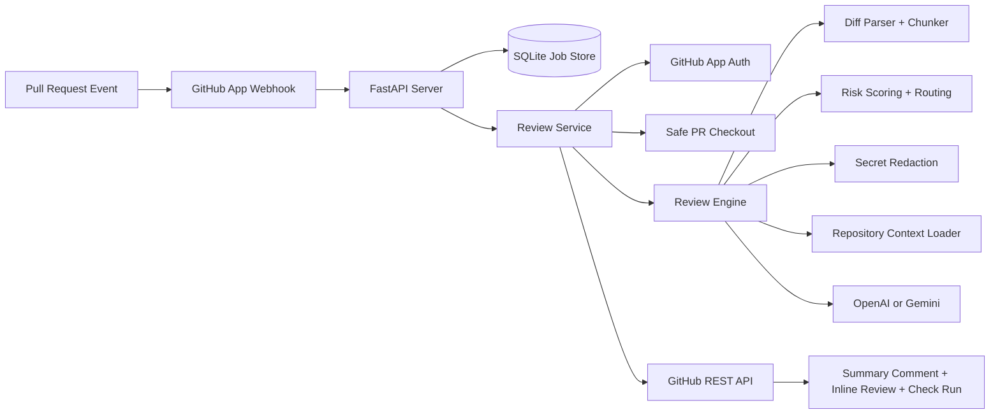
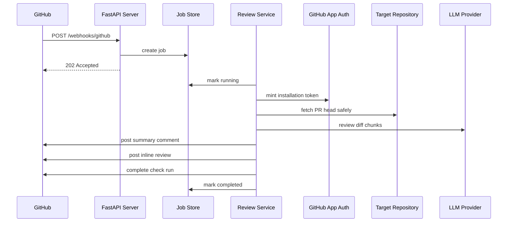
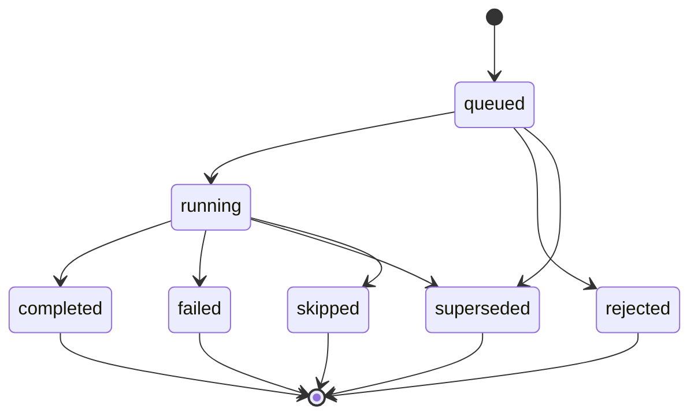

# AI PR Review Bot

Production-grade AI pull request review bot built in Python.

This repository is designed for the GitHub App model: you deploy one backend, install one GitHub App on many repositories, and the service reviews pull requests across all of them. It also keeps a local CLI path for single-repo testing and self-hosted experiments.

It now also includes a built-in operator dashboard so the product feels like a complete review service, not just a webhook consumer.

## What This Repository Does

When a pull request is opened, synchronized, reopened, or marked ready for review:

1. GitHub sends a webhook to this service.
2. The service verifies the signature and creates a review job.
3. The worker fetches the PR safely from `refs/pull/<number>/head`.
4. The review engine chunks the diff, scores PR risk, redacts likely secrets, loads repository context, and sends the review prompt to an LLM.
5. The bot posts a summary comment, optional inline review comments, and a GitHub check run back to the PR.
6. The service dashboard shows queue pressure, recent jobs, provider usage, and persisted review details.

## Visual Overview





More detailed architecture notes live in [docs/architecture.md](./docs/architecture.md).

## How To Use It

### Option 1: Global GitHub App Service

This is the main production path.

1. Create a GitHub App with:
   - `Contents: Read-only`
   - `Checks: Read & write`
   - `Pull requests: Read & write`
   - `Issues: Read & write`
   - `Metadata: Read-only`
   - webhook event: `Pull request`
2. Copy [.env.example](./.env.example) to `.env` and fill in:
   - `GITHUB_APP_ID`
   - `GITHUB_APP_PRIVATE_KEY` or `GITHUB_APP_PRIVATE_KEY_PATH`
   - `GITHUB_WEBHOOK_SECRET`
   - `OPENAI_API_KEY` or `GOOGLE_API_KEY`
3. Install dependencies:

```bash
python3 -m pip install -e .
```

4. Start the service:

```bash
ai-pr-review-server
```

5. Expose the server publicly:

```bash
ngrok http 8000
```

6. Put the public URL into your GitHub App webhook settings:

```text
https://your-public-domain/webhooks/github
```

7. Install the GitHub App on one or more repositories.
8. Open or update a pull request.
9. The bot will post:
   - a summary PR comment
   - inline review comments on changed lines
   - a GitHub check run
10. Open the service root URL in a browser to see the operator dashboard, risk mix, and recent job insights.

### Option 2: Local Single-Repo CLI Review

This is useful when you want to test prompts and formatting without the full GitHub App flow.

```bash
ai-pr-review --repo-root . --event-path "$GITHUB_EVENT_PATH"
```

### Option 3: Docker Deployment

```bash
docker build -t ai-pr-review .
docker run --env-file .env -p 8000:8000 ai-pr-review
```

## What You See In GitHub

The bot behaves like a real PR review bot, not just a log printer.

- A summary comment is added to the pull request conversation.
- Inline comments can appear directly on changed lines.
- A check run shows progress and final conclusion:
  - `success`
  - `neutral`
  - `action_required`
  - `failure`

If `PUBLIC_BASE_URL` is set, the check run can also link back to this service's job detail endpoint.

## Built-In Dashboard

Open the service root URL:

```text
http://127.0.0.1:8000/
```

The dashboard provides:

- live queue and worker pressure
- recent jobs across repositories
- provider usage mix
- adaptive risk-routing mix and top repositories
- persisted review detail pages for each job
- check-run detail links when `PUBLIC_BASE_URL` is configured

## Repository Map

If you are new to the codebase, this is the fastest way to orient yourself.

| Path | Responsibility | Open This When |
| --- | --- | --- |
| `src/pr_review_bot/server.py` | FastAPI app, webhooks, health/readiness, metrics | You want to understand the HTTP surface |
| `src/pr_review_bot/dashboard.py` | HTML control plane and job detail views | You want the product-facing UI |
| `src/pr_review_bot/review_service.py` | Background orchestration, queueing, cancellation, GitHub posting | You want the end-to-end job lifecycle |
| `src/pr_review_bot/reviewer.py` | Diff review pipeline and report building | You want to understand how a PR becomes findings |
| `src/pr_review_bot/risk.py` | PR risk scoring and adaptive review routing | You want to understand model escalation decisions |
| `src/pr_review_bot/llm_client.py` | OpenAI/Gemini calls, retries, fallback logic | You want to change provider behavior |
| `src/pr_review_bot/github_app.py` | GitHub App JWT and installation tokens | You are debugging auth |
| `src/pr_review_bot/github_api.py` | Posting comments, reviews, check runs | You are debugging GitHub output |
| `src/pr_review_bot/checkout.py` | Safe checkout of PR refs | You are debugging git fetch or merge-base issues |
| `src/pr_review_bot/storage.py` | SQLite job persistence and queue state | You want job history or metrics |
| `src/pr_review_bot/config.py` | `.ai-review.yml` parsing and defaults | You want to change bot behavior safely |
| `src/pr_review_bot/runtime.py` | `.env` loading and service settings | You want to change runtime knobs |
| `src/pr_review_bot/webhooks.py` | webhook verification and request extraction | You are debugging webhook intake |
| `src/pr_review_bot/redaction.py` | secret masking before model calls | You are reviewing data safety |
| `tests/` | unit coverage for parser, storage, runtime, redaction, LLM helpers | You want guardrails before changing behavior |

## Review Job Lifecycle



Important runtime behavior:

- newer commits on the same PR can supersede older queued or running jobs
- queue limits protect LLM spend under webhook bursts
- stale jobs can abort before posting outdated comments
- low-risk changes can route to a lighter review profile while high-risk changes escalate reasoning and issue budgets
- likely secrets are redacted before model calls

## Configuration

### Runtime `.env`

Important service-level settings:

- `LLM_PROVIDER`
- `OPENAI_API_KEY` or `GOOGLE_API_KEY`
- `GITHUB_APP_ID`
- `GITHUB_APP_PRIVATE_KEY` or `GITHUB_APP_PRIVATE_KEY_PATH`
- `GITHUB_WEBHOOK_SECRET`
- `DATABASE_URL`
- `WORKSPACE_ROOT`
- `MAX_PARALLEL_REVIEWS`
- `MAX_PENDING_REVIEWS`
- `MAX_REPO_ACTIVE_REVIEWS`
- `CANCEL_SUPERSEDED_REVIEWS`
- `PUBLIC_BASE_URL`

### Per-Repository `.ai-review.yml`

Installed repositories can customize:

- model and fallback model
- diff chunk sizing
- inline comment and issue limits
- adaptive risk routing behavior
- ignore rules
- repository context files
- secret redaction behavior

For safety, repository config cannot redirect GitHub API hosts.

## HTTP Endpoints

| Endpoint | Purpose |
| --- | --- |
| `POST /webhooks/github` | Receives GitHub App webhook deliveries |
| `GET /` | HTML control plane dashboard |
| `GET /dashboard` | Dashboard alias |
| `GET /healthz` | Basic liveness probe |
| `GET /readyz` | Queue-aware readiness probe |
| `GET /jobs` | Recent jobs across all repositories |
| `GET /jobs/{job_id}` | One job's status and summary |
| `GET /jobs/{job_id}/view` | Human-friendly job detail page |
| `GET /repos/{owner}/{repo}/pulls/{pull_number}/jobs` | Job history for a pull request |
| `GET /metrics` | Prometheus-style metrics |

## Local Development

```bash
python3 -m pip install -e .
ai-pr-review-server
```

Then in another terminal:

```bash
curl http://127.0.0.1:8000/healthz
curl http://127.0.0.1:8000/readyz
curl http://127.0.0.1:8000/metrics
```

And in a browser:

```text
http://127.0.0.1:8000/
```

## Security Notes

- Webhooks are verified with `X-Hub-Signature-256`.
- GitHub access uses short-lived installation tokens.
- The checkout path fetches code but does not execute untrusted PR workflows.
- Potential secrets in PR metadata, diff content, and repository snippets are redacted before LLM review.
- Superseding stale jobs reduces outdated feedback and wasted model spend.

## Self-Hosted Single-Repo Mode

The older per-repository GitHub Action path still exists at [.github/workflows/ai-pr-review.yml](./.github/workflows/ai-pr-review.yml). That mode is useful for experiments, but the GitHub App service is the main path for multi-repo deployments.
