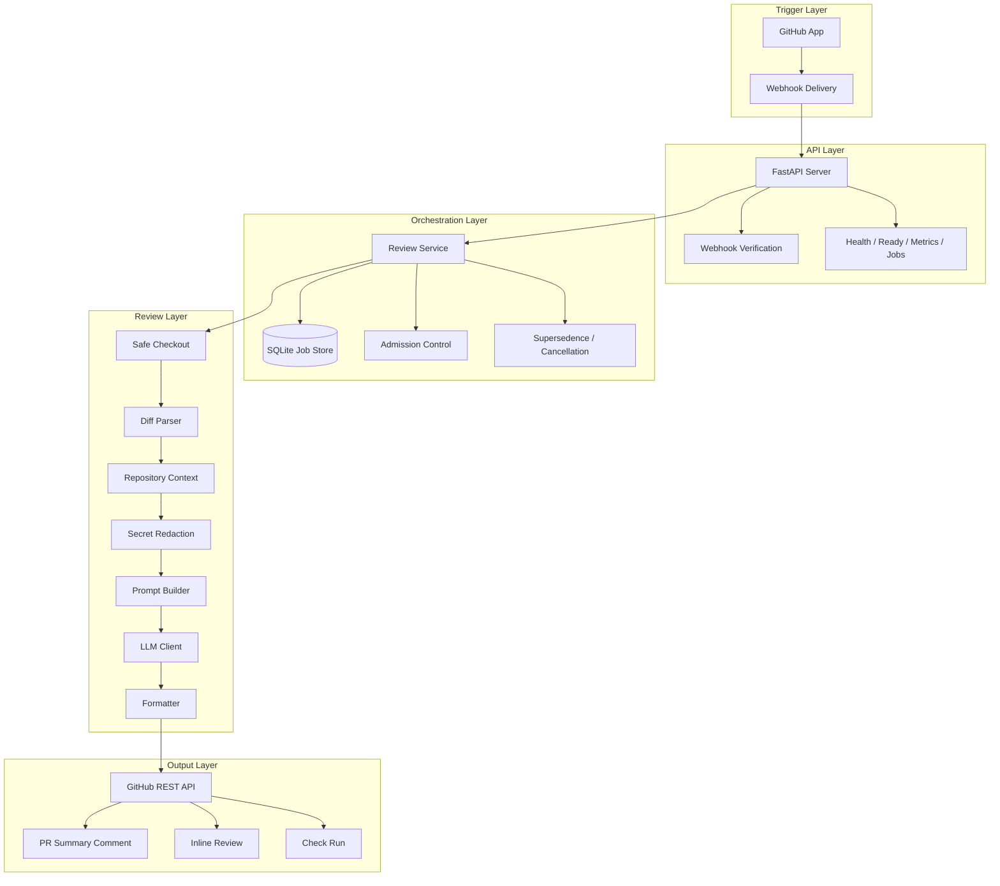
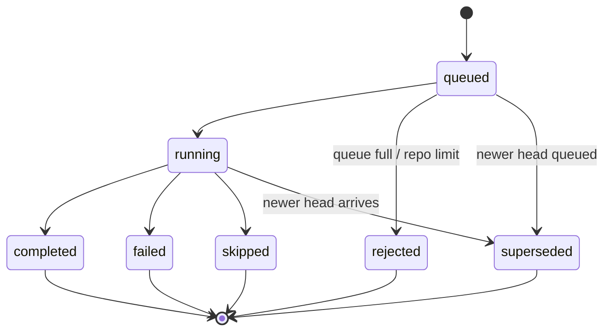

# Architecture Guide

This document is the deeper companion to the main [README](../README.md). It is meant for engineers who want to understand how the system is put together before they start changing code.

## System Layers



## Main Runtime Path

1. `server.py` receives `POST /webhooks/github`.
2. `webhooks.py` validates the GitHub signature and turns the payload into a `ReviewRequest`.
3. `storage.py` creates or reuses a job record.
4. `review_service.py` applies queue rules and can supersede older jobs for the same pull request.
5. `github_app.py` mints an installation token for the target repository.
6. `checkout.py` fetches the pull request head safely into a workspace.
7. `reviewer.py` builds the diff, filters ignored files, loads repository context, redacts secrets, and calls `llm_client.py`.
8. `github_api.py` posts comments and check runs back to GitHub.
9. `storage.py` records the final job status and summary.

## Job States



## Why The Service Is Structured This Way

### `server.py`

This keeps the HTTP surface small and predictable:

- webhook intake
- health and readiness
- metrics
- job inspection

### `review_service.py`

This is the operational center of the system. It owns:

- job submission
- queue admission
- cancellation and supersedence
- end-to-end orchestration
- check run lifecycle

### `reviewer.py`

This is the review pipeline. It should stay deterministic and side-effect light:

- diff extraction
- patch filtering
- chunk creation
- secret redaction
- model invocation
- finding aggregation

### `llm_client.py`

This isolates provider-specific behavior:

- OpenAI vs Gemini
- retry logic
- unsupported parameter handling
- fallback models
- compact retries for long responses

### `storage.py`

This gives the service memory:

- job states
- queue depth
- metrics aggregation
- per-PR history

## Repository Layout

```text
src/pr_review_bot/
├── server.py              # FastAPI app and endpoints
├── review_service.py      # Background orchestration and queue logic
├── reviewer.py            # Review pipeline
├── llm_client.py          # LLM provider integration
├── github_app.py          # GitHub App authentication
├── github_api.py          # Comment/review/check-run posting
├── checkout.py            # Safe checkout of PR code
├── storage.py             # SQLite-backed job persistence
├── config.py              # .ai-review.yml parsing
├── runtime.py             # .env parsing and runtime settings
├── webhooks.py            # Webhook verification and request building
├── diff_parser.py         # Unified diff parsing and line mapping
├── repository_context.py  # Extra file context loading
├── redaction.py           # Secret masking before model calls
├── formatter.py           # PR comment formatting
├── prompts.py             # Prompt templates
└── tests/                 # Unit coverage
```

## How Engineers Usually Navigate This Repo

If something is wrong with:

- webhook delivery: start at `server.py` and `webhooks.py`
- queue behavior: start at `review_service.py` and `storage.py`
- checkout failures: start at `checkout.py` and `git_utils.py`
- missing or strange findings: start at `reviewer.py`, `prompts.py`, and `llm_client.py`
- comments not appearing in GitHub: start at `github_api.py`
- unexpected config: start at `runtime.py`, `config.py`, and `.ai-review.yml`

## Operations Checklist

Before calling the deployment healthy, confirm:

1. `GET /healthz` returns `200`.
2. `GET /readyz` returns `200`.
3. `GET /metrics` exposes queue and job metrics.
4. GitHub App permissions include `Checks`, `Pull requests`, `Issues`, `Contents`, and `Metadata`.
5. The webhook secret matches between `.env` and the GitHub App settings.
6. The app is installed on the target repository.
7. The configured LLM provider key is valid.
